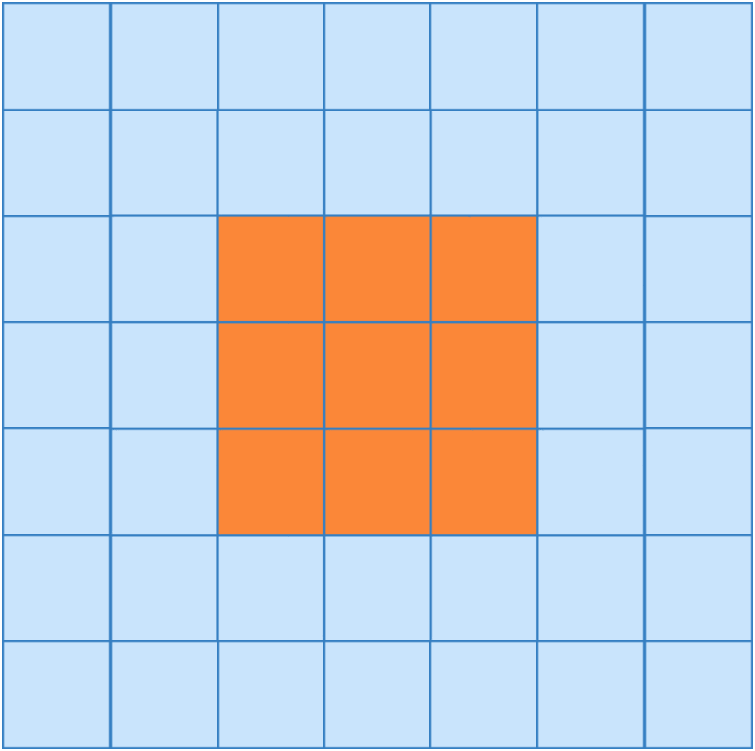
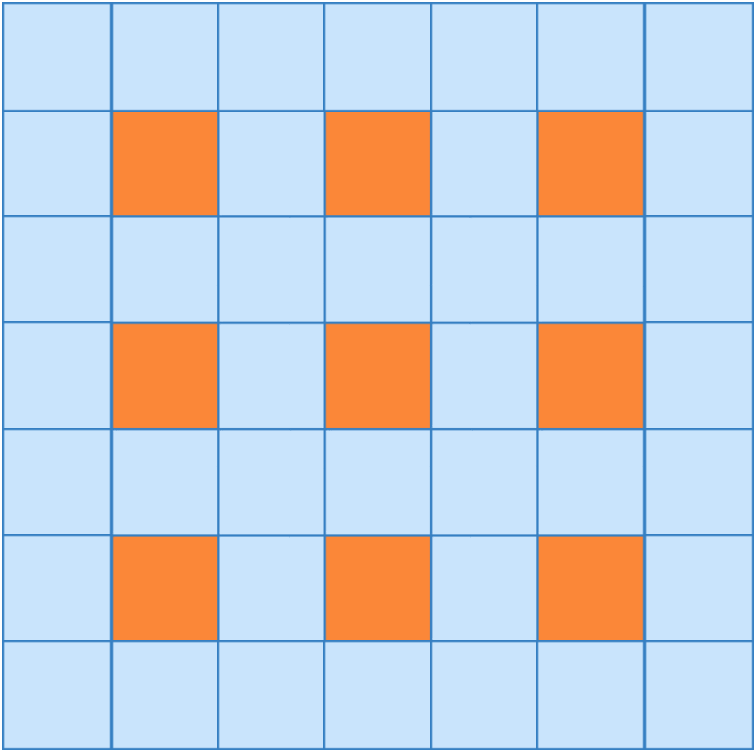
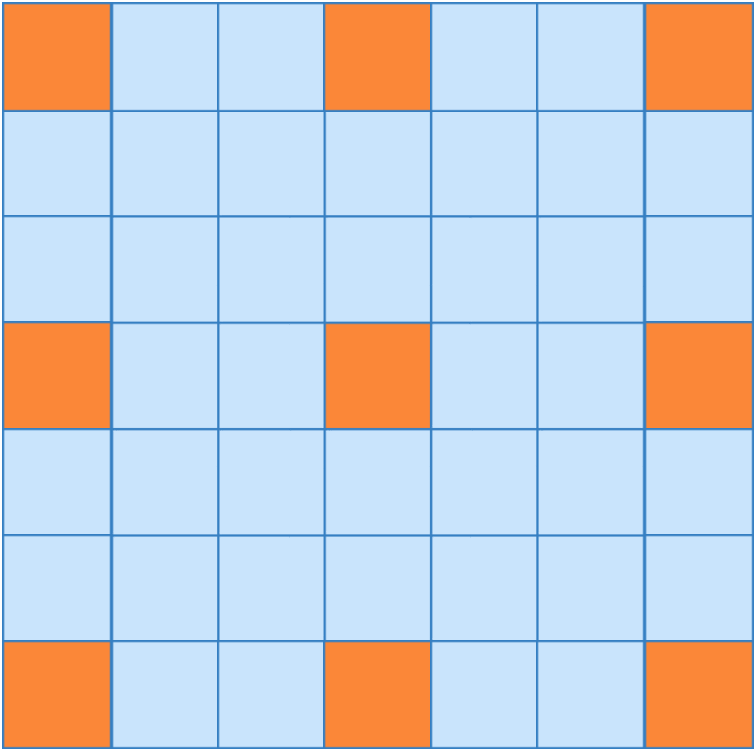
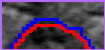
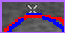

# FCDDN

This repository is FCDDN segmentation of thyroid nodules ultrasound images.

The Thyroid dataset contains 3794 ultrasound images. The training set, validation set and test set containing 3034, 380 and 380 images respectively.
The External Thyroid dataset contains 124 ultrasound images, for testing only.

# DSMA-Net Architecture

  

The framework of Fully Convolutional Dense Dilated Net (FCDDN). 

  
  
  

  

  
  
  

Dense Layer, Dense Dilated Block and Dilated convolution.

  
  
  
  
  
  
  

Segmentation results

## Prerequisites
- Python 3.6+
- PyTorch 1.0+

## Usage
`FCDDN.py` is our proposed network, `train.py` is used for training, `test.py` is used for testing, `predict.py` is used to display the segmented image, and `parameters.py` is used to calculate the number of parameters.
