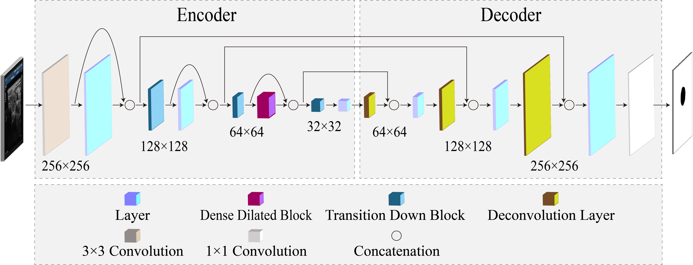
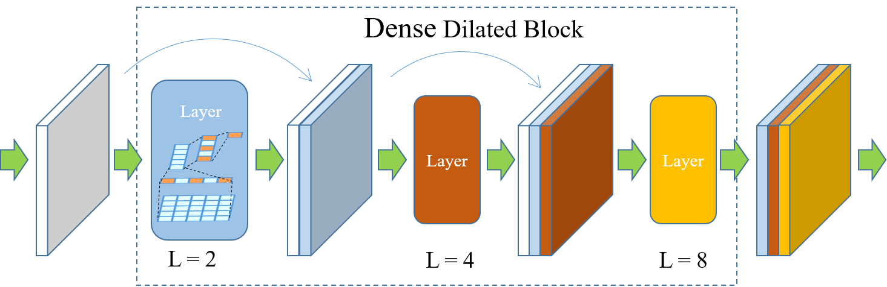
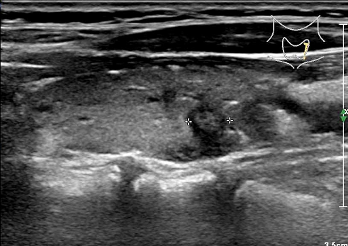
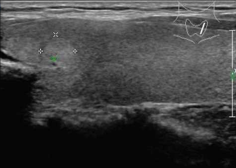
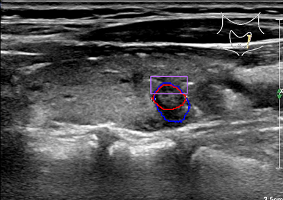
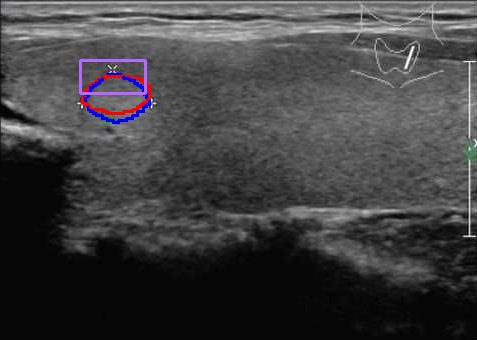

# FCDDN

This repository is FCDDN segmentation of thyroid nodules ultrasound images.

The Thyroid dataset contains 3794 ultrasound images. Experiments can be performed using cross-validation.
The External Thyroid dataset contains 124 ultrasound images, for testing only.

We will upload the data as soon as the hospital dataset is publicly available.

## FCDDN Architecture
<div align="center">
  
</div>
The framework of Fully Convolutional Dense Dilated Net (FCDDN). 

<div align="center">
  
</div>

Dense Dilated Block

## Segmentation results
 <div align="center">
 
 
 </div>

 <div align="center">
 
 
 </div>

# Prerequisites
- Python 3.6+
- PyTorch 1.0+

# Usage
`FCDDN.py` is our proposed network, `train.py` is used for training, `test.py` is used for testing, `predict.py` is used to display the segmented image, and `parameters.py` is used to calculate the number of parameters.

## Citing
If you find this work useful in your research, please consider citing the following papers:
```BibTex
@inproceedings{xing2024real,
  title={Real-time reliable semantic segmentation of thyroid nodules in ultrasound images},
  author={Xing, Guangxin and Wang, Shuaijie and Gao, Jie and Li, Xuewei},
  journal={Physics in Medicine and Biology},
  volume={69},
  number={2},
  pages={025016},
  year={2024},
  doi={10.1088/1361-6560/ad1210},
  url = {https://dx.doi.org/10.1088/1361-6560/ad1210},
  publisher={IOP Publishing}
}
```
